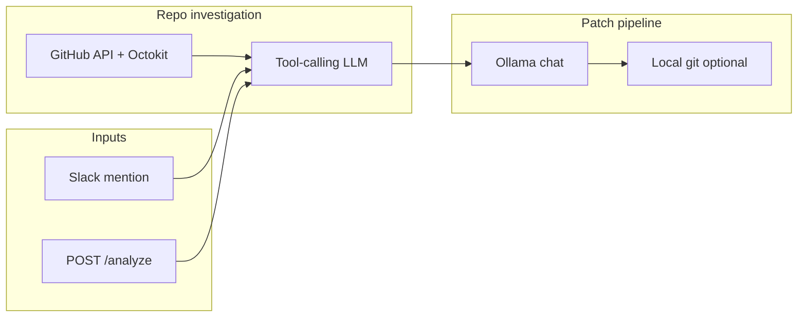

# AI Debugger

**Autonomous debugging for your GitHub repo** — describe a bug in Slack or over HTTP, and this backend inspects the repository with tool-calling LLMs, synthesizes a diagnosis, then asks a coding model to emit a **unified diff**. When a local clone is configured, it can **apply, commit, and push** a fix branch for you to open as a pull request.

---

## Why this exists

Traditional “ask the model about my bug” flows often hallucinate file paths or skip reading real code. This service chains two grounded steps:

1. **Repo investigation** — An agent loop (up to 8 tool rounds) uses GitHub’s API to search code, list paths, read files, and inspect recent commits. The model must ground its final answer in what the tools actually returned.
2. **Patch generation** — A second pass takes the issue plus that diagnosis and returns **only** a valid git unified diff. If a local repository is available, the patch can be applied and pushed automatically.

---

## Features

| Capability | Description |
|------------|-------------|
| **Slack bot** | Mention the app in a channel; replies in-thread with analysis (and optional patch workflow). |
| **HTTP API** | `POST /analyze` for integrations, scripts, or a frontend. |
| **GitHub tools** | `searchCode`, `readFile`, `listFiles`, `recentCommits` — with code-search fallbacks when the index misses symbols. |
| **Local git workflow** | Optional clone path: create branch → `git apply` → commit → `git push` on an `ai-fix-*` branch. |
| **Ollama-first** | Runs against your own Ollama host; model names are configurable via environment variables. |

---

## Architecture



---

## Prerequisites

- **Node.js** (ES modules; `type: "module"` in `package.json`)
- **Ollama** reachable at the URL you configure (with auth if your setup requires it)
- **GitHub**: a personal access token with appropriate repo scope for `GITHUB_OWNER` / `GITHUB_REPO`
- **Slack app** (for the bot): Bot token, signing secret, and app-level token for **Socket Mode**

---

## Quick start

```bash
cd backend
npm install
cp .env.example .env   # create and fill — see table below
npm start
```

The HTTP server listens on **port 5001**. The Slack bot starts in the same process.

---

## Environment variables

Create a `.env` file in this directory. Do not commit secrets.

| Variable | Required | Purpose |
|----------|----------|---------|
| `GITHUB_OWNER` | Yes | GitHub org or user owning the target repo |
| `GITHUB_REPO` | Yes | Repository name |
| `GITHUB_OCTOKIT_TOKEN` | Yes | GitHub token for Octokit (repo contents, search, git data) |
| `OLLAMA_HOST` | Yes | Base URL for Ollama (e.g. `http://127.0.0.1:11434`) |
| `OLLAMA_AUTH_TOKEN` | If your Ollama uses auth | `Authorization` bearer token |
| `OLLAMA_MODEL` | No | Defaults to `gpt-oss:20b` |
| `SLACK_TOKEN` | For Slack | Bot user OAuth token (`xoxb-...`) |
| `SLACK_SIGNING_SECRET` | For Slack | Signing secret from app settings |
| `SLACK_APP_TOKEN` | For Socket Mode | App-level token (`xapp-...`) |
| `LOCAL_REPO_PATH` | No | Absolute path to a **local clone** of the same repo for apply/commit/push; if unset, a default relative path under the project may be used |

---

## API

### `POST /analyze`

**Body:** JSON with an `issue` string (natural language bug report).

**Response:** JSON `{ "analysis": "<markdown-ish text>" }` containing the diagnosis from repo inspection and either a suggested patch, apply status, or instructions if auto-apply is not configured.

Example:

```bash
curl -s -X POST http://localhost:5001/analyze \
  -H "Content-Type: application/json" \
  -d '{"issue":"Login button does nothing on the settings page"}'
```

---

## Slack usage

1. Install the app to your workspace and enable **Socket Mode**.
2. Subscribe to the `app_mention` event and grant chat scopes needed to post messages.
3. Mention the bot in a channel with your bug description. The bot responds **in the same thread** with the full analysis output.

---

## How the local patch path works

When `LOCAL_REPO_PATH` points to a valid git repository (or the resolved default path contains `.git`):

1. A branch named `ai-fix-<timestamp>` is created.
2. The model’s unified diff is written and applied with `git apply`.
3. Changes are committed with message `AI bug fix` and pushed to `origin` on that branch.

You then open a PR from that branch in GitHub. If no clone is available, the README-style patch is still returned in the analysis text for manual application.

---

## Project layout

```
backend/
├── server.js              # Express + Slack Bolt (Socket Mode)
├── ai.js                  # Ollama patch generation + optional git apply/push
├── services/
│   ├── githubService.js   # debugIssue: tool loop + GitHub integration
│   └── gitService.js      # Local repo path, branch, apply, commit, push
├── package.json
└── .env                   # local secrets (gitignored)
```

---

## Scripts

| Command | Action |
|---------|--------|
| `npm start` | Run `node server.js` |

---

## License

ISC (see `package.json`).

---

*Built for learning and iteration — tune models, tighten prompts, and scope GitHub tokens to the minimum your workflow needs.*
