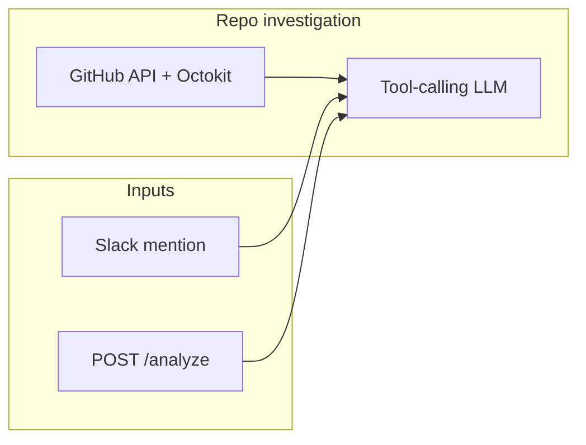

# AI Debugger

**Repo-aware debugging for GitHub projects** — describe an error or ask about files/functions in Slack or over HTTP. The backend reads the configured GitHub repository with Octokit tools, grounds the answer in real files, and replies with diagnosis or information only. It does not generate or apply patches.

---

## Why this exists

Traditional “ask the model about my bug” flows often hallucinate file paths or skip reading real code. This service runs a tool-calling investigation loop that can search code, list paths, read files, and inspect recent commits before answering.

---

## Features

| Capability | Description |
|------------|-------------|
| **Slack bot** | Mention the app in a channel; replies in-thread with grounded analysis or file/function info. |
| **HTTP API** | `POST /analyze` for integrations, scripts, or a frontend. |
| **GitHub tools** | `searchCode`, `readFile`, `listFiles`, `recentCommits` with content-scan fallbacks when GitHub code search misses symbols. |
| **Private/public repos** | Uses a GitHub token when provided; direct GitHub file links in Slack messages are parsed and pre-read. |
| **Ollama-first** | Runs against your own Ollama host; model names are configurable via environment variables. |

---

## Architecture



---

## Prerequisites

- **Node.js** compatible with the installed dependencies
- **Ollama** reachable at the URL you configure
- **GitHub**: a personal access token with access to `GITHUB_OWNER` / `GITHUB_REPO`; private repos require token access
- **Slack app** (for the bot): Bot token, signing secret, and app-level token for **Socket Mode**

---

## Quick Start

```bash
cd backend
npm install
cp .env.example .env
npm start
```

The HTTP server listens on **port 5001**. The Slack bot starts in the same process.

---

## Environment Variables

Create a `.env` file in this directory. Do not commit secrets.

| Variable | Required | Purpose |
|----------|----------|---------|
| `GITHUB_OWNER` | Yes | GitHub org or user owning the default target repo. |
| `GITHUB_REPO` | Yes | Default target repository name. |
| `GITHUB_TOKEN` | Yes for private repos, recommended for public repos | GitHub token for Octokit. Fine-grained tokens need **Contents: read** and **Metadata: read** access to the target repo. |
| `GITHUB_OCTOKIT_TOKEN` | No | Legacy alias used when `GITHUB_TOKEN` is not set. |
| `OLLAMA_HOST` | Yes | Base URL for Ollama, e.g. `http://127.0.0.1:11434`. |
| `OLLAMA_AUTH_TOKEN` | If your Ollama uses auth | Authorization bearer token. |
| `OLLAMA_MODEL` | No | Defaults to `gpt-oss:20b`. |
| `SLACK_TOKEN` | For Slack | Bot user OAuth token. |
| `SLACK_SIGNING_SECRET` | For Slack | Signing secret from app settings. |
| `SLACK_APP_TOKEN` | For Socket Mode | App-level token. |

---

## API

### `POST /analyze`

**Body:** JSON with an `issue` string.

**Response:** JSON `{ "analysis": "<markdown-ish text>" }` containing repo-grounded error analysis or file/function information.

Example:

```bash
curl -s -X POST http://localhost:5001/analyze \
  -H "Content-Type: application/json" \
  -d '{"issue":"What does middlewares/authMiddleWare.js do?"}'
```

---

## Slack Usage

1. Install the app to your workspace and enable **Socket Mode**.
2. Subscribe to the `app_mention` event and grant chat scopes needed to post messages.
3. Mention the bot with an error, file path, function name, or GitHub file link. The bot responds in the same thread.

---

## Project Layout

```
backend/
├── server.js              # Express + Slack Bolt
├── services/
│   ├── aiService.js       # Ollama prompt, tool loop, and final answer
│   └── githubService.js   # GitHub URL parsing, repo access, and tools
├── package.json
└── .env                   # local secrets (gitignored)
```

---

## Scripts

| Command | Action |
|---------|--------|
| `npm start` | Run `node server.js` |

---

## License

ISC (see `package.json`).
